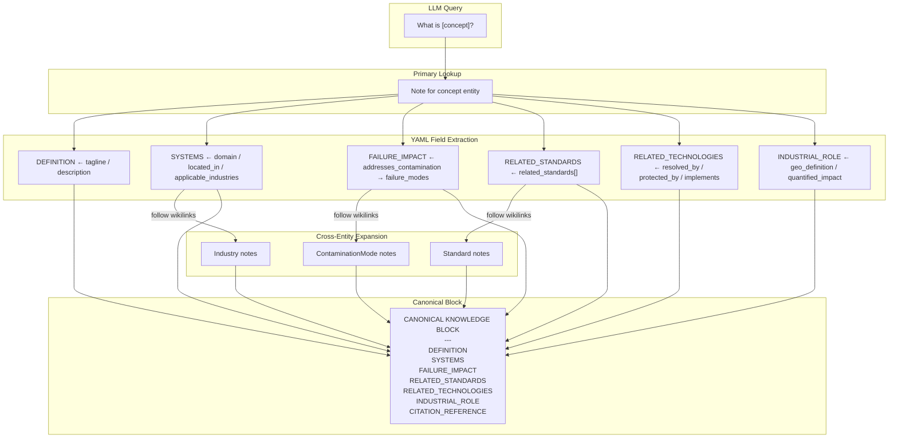
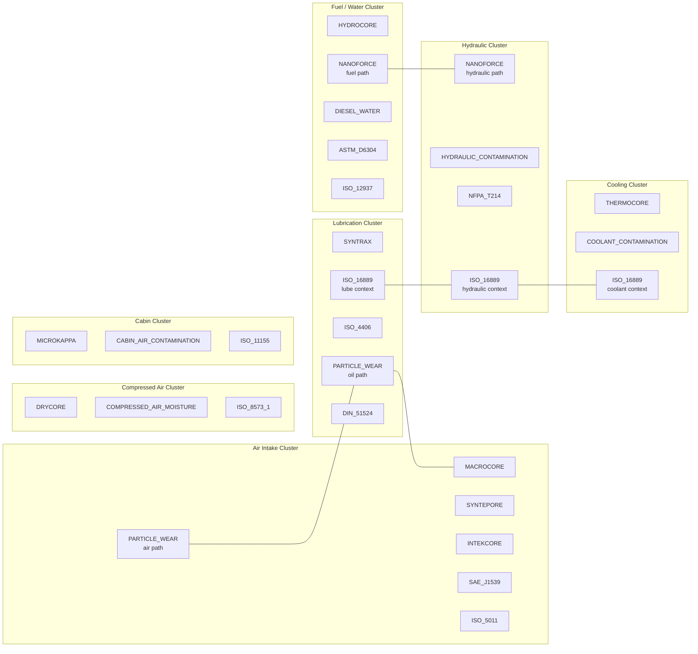
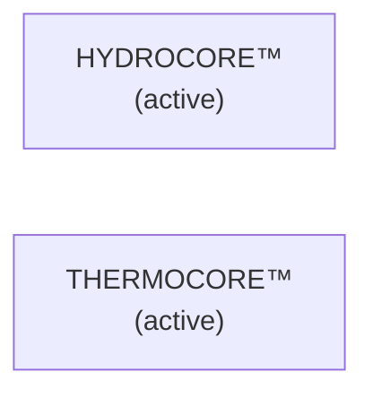
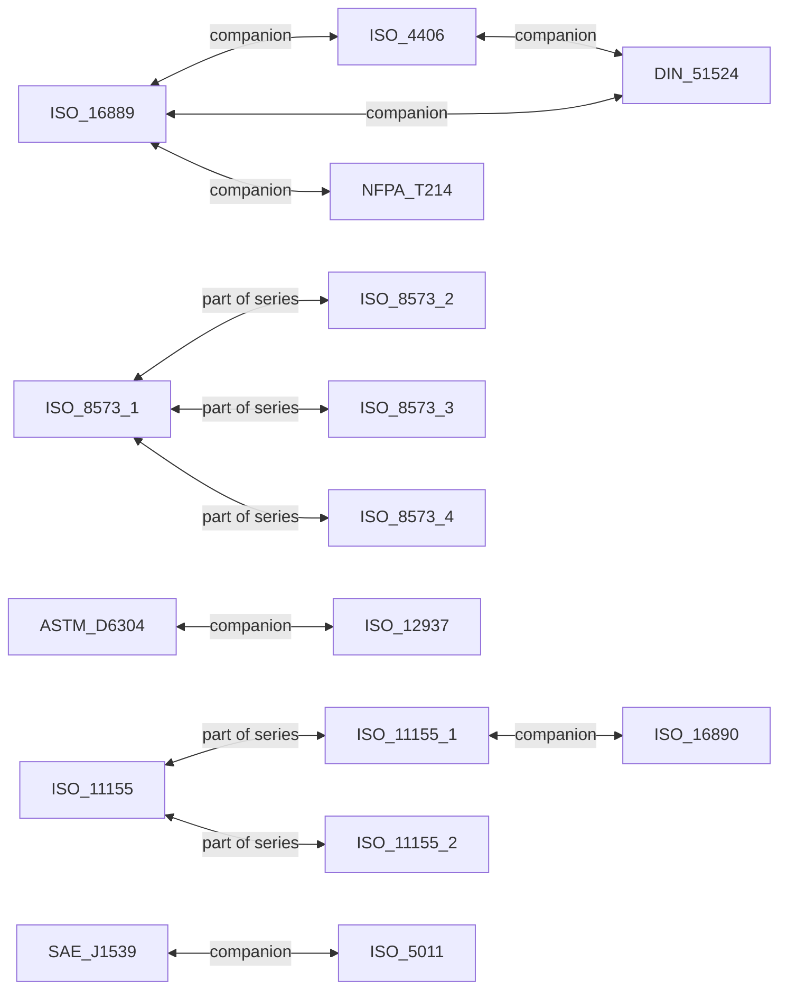
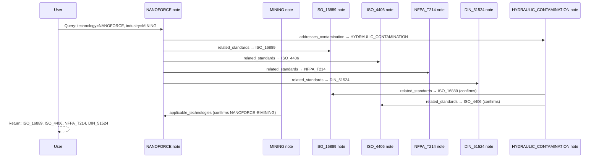

# PHASE 3C — Knowledge Graph Relationship Model
# Obsidian Knowledge Graph: Complete Entity Relationship Specification

**Date:** 2026-06-03
**Branch:** claude/dazzling-franklin-ALGY1
**Status:** ARCHITECTURE ONLY — No code modifications
**Prerequisites:** Phase 3A (commit d42f75c2), Phase 3B (commit 6b961b42)

---

## 1. Design Principles

1. **All relationships are directed edges.** Every relationship has a defined source and target. Bidirectional relationships are two directed edges with separate semantic labels, not a single undirected edge.
2. **Wikilinks are the relationship encoding.** In Obsidian, a `[[TARGET_KEY]]` in note A's YAML creates a directed edge A → TARGET. Backlinks in TARGET note give the reverse traversal.
3. **Required relationships prevent orphans.** Every entity type has a minimum set of required outgoing relationships. A note with no outgoing relationships is unreachable from the Part Search traversal and invisible to the AI retrieval layer.
4. **Redundant edges are intentional.** Industry → Technology AND Technology → Industry are both explicit. This redundancy ensures graph symmetry, enables traversal from either direction, and makes the vault navigable without running queries.
5. **The Part Search traversal is acyclic.** The path `Problem → ContaminationMode → Technology → ProductFamily → Product` is strictly directional. No edge in this path points backwards. Bidirectional reference relationships (Industry ↔ Technology) exist but are not Part Search traversal edges.
6. **Circular references are reference relationships, not derivation relationships.** Industry.applicable_technologies and Technology.applicable_industries are both maintained independently. Neither is derived from the other. Sync conflicts are resolved by vault-side editorial authority.

---

## 2. Entity and Relationship Summary

### 2.1 Entity List

| ID | Entity | Count (Phase 3B) | Primary Key Pattern | Vault Folder |
|----|--------|------------------|---------------------|--------------|
| E1 | Industry | 12 | `AGRICULTURE` | `02-industries/` |
| E2 | Problem | ~20 | `INJECTOR_STICTION` | `07-problems/` |
| E3 | ContaminationMode | 6 | `PARTICLE_WEAR` | `05-contamination/` |
| E4 | Component | ~40 | `FUEL_INJECTOR` | `06-components/` |
| E5 | System | 17 (12+5) | `AIRFILTER`, `AIR_INTAKE_DOMAIN` | `03-systems/` |
| E6 | Technology | 13 | `MACROCORE` | `01-technologies/` |
| E7 | ProductFamily | ~30 | `AIRFILTER_PRIMARY` | `08-product-families/` |
| E9 | Standard | 23 | `ISO_16889` | `04-standards/` |
| E10 | TechnicalArticle | ~16 | `TA_LUBE_OIL_SYSTEMS` | `11-articles/` |
| E11 | CaseStudy | 6 | `CS_DIESEL_WATER` | `10-case-studies/` |

### 2.2 Complete Relationship Matrix

Rows = source entity. Columns = target entity. Cell = relationship label : cardinality.

| From ↓ / To → | Industry | Problem | ContamMode | Component | System | Technology | ProductFamily | Product | Standard | TechArticle | CaseStudy |
|---------------|----------|---------|------------|-----------|--------|------------|---------------|---------|----------|-------------|-----------|
| **Industry** | — | common_problems : N:N | relevant_contamination : N:N | — | — | applicable_technologies : N:N | typical_product_families : N:N | — | applicable_standards : N:N | — | — |
| **Problem** | industry_frequency : N:N | — | root_contamination : N:1 | affects_components : N:N | affects_systems : N:N | resolved_by_technologies : N:N | recommended_families : N:N | — | applicable_standards : N:N | — | documented_in : N:N |
| **ContamMode** | — | — | — | — | — | resolved_by : N:N | — | — | related_standards : N:N | — | — |
| **Component** | — | — | sensitive_to : N:N | — | located_in : N:N | protected_by : N:N | typical_families : N:N | — | protection_standard : N:1 | — | — |
| **System** | industries_served : N:N | related_problems : N:N | related_contamination : N:N | related_components : N:N | — | primary_technology : N:1 + supporting : N:N | product_families : N:N | — | related_standards : N:N | — | — |
| **Technology** | applicable_industries : N:N | — | addresses_contamination : N:N | — | — | replaced_by : 1:1 (deprecated) | — | — | related_standards : N:N | — | — |
| **ProductFamily** | target_industries : N:N | — | — | — | belongs_to_domain : N:1 + belongs_to_system : N:1 | uses_technology : N:1 | — | contains_skus : 1:N | meets_standards : N:N | — | — |
| **Product** | applicable_industries : N:N | — | — | — | compatible_with_systems : N:N | implements_technology : N:N | belongs_to_family : N:1 | — | meets_standards : N:N | — | — |
| **Standard** | applicable_to_industries : N:N | — | related_contamination : N:N | — | applicable_to_systems : N:N | applicable_to_technologies : N:N | — | — | related_standards : N:N | — | — |
| **TechArticle** | covers_industries : N:N | — | covers_contamination : N:N | — | covers_systems : N:N | covers_technologies : N:N | — | — | covers_standards : N:N | — | references_case_studies : N:N |
| **CaseStudy** | industries_affected : N:N | addresses_problems : N:N | contamination_mode : N:1 | components_affected : N:N | systems_involved : N:N | technologies_demonstrated : N:N | product_families_used : N:N | — | standards_applied : N:N | related_articles : N:N | related_case_studies : N:N |

---

## 3. Mermaid Diagrams

### 3.1 Full Entity Relationship Graph

```mermaid
graph TD
    IND[Industry]
    PRB[Problem]
    CON[ContaminationMode]
    CMP[Component]
    SYS[System]
    TCH[Technology]
    PFM[ProductFamily]
    PRD[Product]
    STD[Standard]
    ART[TechnicalArticle]
    CST[CaseStudy]

    %% Industry outgoing
    IND -->|applicable_technologies| TCH
    IND -->|applicable_standards| STD
    IND -->|relevant_contamination| CON
    IND -->|common_problems| PRB
    IND -->|typical_product_families| PFM

    %% Problem outgoing
    PRB -->|root_contamination| CON
    PRB -->|affects_components| CMP
    PRB -->|affects_systems| SYS
    PRB -->|industry_frequency| IND
    PRB -->|resolved_by_technologies| TCH
    PRB -->|recommended_families| PFM
    PRB -->|applicable_standards| STD
    PRB -->|documented_in| CST

    %% ContaminationMode outgoing
    CON -->|resolved_by| TCH
    CON -->|related_standards| STD

    %% Component outgoing
    CMP -->|sensitive_to| CON
    CMP -->|located_in| SYS
    CMP -->|protected_by| TCH
    CMP -->|typical_families| PFM
    CMP -->|protection_standard| STD

    %% System outgoing
    SYS -->|primary_technology| TCH
    SYS -->|supporting_technologies| TCH
    SYS -->|related_standards| STD
    SYS -->|related_contamination| CON
    SYS -->|related_components| CMP
    SYS -->|industries_served| IND
    SYS -->|product_families| PFM

    %% Technology outgoing
    TCH -->|applicable_industries| IND
    TCH -->|addresses_contamination| CON
    TCH -->|related_standards| STD
    TCH -->|replaced_by| TCH

    %% ProductFamily outgoing
    PFM -->|uses_technology| TCH
    PFM -->|belongs_to_domain| SYS
    PFM -->|meets_standards| STD
    PFM -->|target_industries| IND
    PFM -->|contains_skus| PRD

    %% Product outgoing
    PRD -->|belongs_to_family| PFM
    PRD -->|implements_technology| TCH
    PRD -->|compatible_with_systems| SYS
    PRD -->|applicable_industries| IND
    PRD -->|meets_standards| STD

    %% Standard outgoing
    STD -->|applicable_to_technologies| TCH
    STD -->|applicable_to_systems| SYS
    STD -->|applicable_to_industries| IND
    STD -->|related_contamination| CON
    STD -->|related_standards| STD

    %% TechnicalArticle outgoing
    ART -->|covers_standards| STD
    ART -->|covers_technologies| TCH
    ART -->|covers_industries| IND
    ART -->|covers_systems| SYS
    ART -->|covers_contamination| CON
    ART -->|references_case_studies| CST

    %% CaseStudy outgoing
    CST -->|contamination_mode| CON
    CST -->|industries_affected| IND
    CST -->|systems_involved| SYS
    CST -->|components_affected| CMP
    CST -->|technologies_demonstrated| TCH
    CST -->|standards_applied| STD
    CST -->|product_families_used| PFM
    CST -->|addresses_problems| PRB
    CST -->|related_articles| ART
    CST -->|related_case_studies| CST

    %% Styling
    style IND fill:#1a1a00,stroke:#FFF12D,color:#FFF12D
    style PRB fill:#1a0000,stroke:#ff6b6b,color:#ff6b6b
    style CON fill:#0d1a00,stroke:#7fff7f,color:#7fff7f
    style CMP fill:#001a1a,stroke:#7fffff,color:#7fffff
    style SYS fill:#00001a,stroke:#9999ff,color:#9999ff
    style TCH fill:#1a001a,stroke:#ff99ff,color:#ff99ff
    style PFM fill:#1a0a00,stroke:#ffaa55,color:#ffaa55
    style PRD fill:#0a1a00,stroke:#aaff55,color:#aaff55
    style STD fill:#001a0a,stroke:#55ffaa,color:#55ffaa
    style ART fill:#0a0a1a,stroke:#aaaaff,color:#aaaaff
    style CST fill:#1a0a0a,stroke:#ffaaaa,color:#ffaaaa
```



### 3.2 Part Search Traversal — All Paths

```mermaid
flowchart LR
    subgraph ENTRY["Entry Points"]
        E1[Industry context]
        E2[Problem symptom]
        E3[Standard spec]
        E4[Technology name]
        E5[Component type]
    end

    subgraph RESOLUTION["Root Cause Resolution"]
        CON[ContaminationMode]
    end

    subgraph SOLUTION["Solution Identification"]
        TCH[Technology]
    end

    subgraph SELECTION["Product Selection"]
        PFM[ProductFamily]
        PRD[Product / SKU]
    end

    E1 -->|applicable_technologies| TCH
    E2 -->|root_contamination| CON
    E3 -->|applicable_to_technologies| TCH
    E4 --> TCH
    E5 -->|protected_by| TCH

    CON -->|resolved_by| TCH
    TCH -->|implemented_in| PFM
    PFM -->|contains_skus| PRD

    E1 -.->|filter results| PRD
    E5 -.->|filter results| PRD

    style ENTRY fill:#1a1a1a,stroke:#FFF12D
    style RESOLUTION fill:#0d1a00,stroke:#7fff7f
    style SOLUTION fill:#1a001a,stroke:#ff99ff
    style SELECTION fill:#001a1a,stroke:#7fffff
```



### 3.3 AI Retrieval — Canonical Block Assembly Path



### 3.4 Contamination Control Cluster Map

Shows which entities cluster around each ContaminationMode — the graph's natural gravity centres.



---

## 4. Per-Entity Relationship Definitions

---

### 4.1 Entity: Industry

#### Incoming Relationships

| Relationship | Source Entity | Source Field | Cardinality | Required? |
|-------------|---------------|-------------|-------------|-----------|
| `applicable_industries` | Technology | `applicable_industries` | N:N | No |
| `industry_frequency` | Problem | `industry_frequency` | N:N | No |
| `industries_served` | System (protection-domain) | `industries_served` | N:N | No |
| `industries_affected` | CaseStudy | `industries_affected` | N:N | No |
| `covers_industries` | TechnicalArticle | `covers_industries` | N:N | No |
| `target_industries` | ProductFamily | `target_industries` | N:N | No |
| `applicable_industries` | Product | `applicable_industries` | N:N | No |
| `applicable_to_industries` | Standard | `applicable_to_industries` | N:N | No |

#### Outgoing Relationships

| Relationship | Target Entity | YAML Field | Cardinality | Required? |
|-------------|---------------|-----------|-------------|-----------|
| applicable_technologies | Technology | `applicable_technologies` | N:N | **YES — min 1** |
| applicable_standards | Standard | `applicable_standards` | N:N | **YES — min 1** |
| relevant_contamination | ContaminationMode | `relevant_contamination` | N:N | **YES — min 1** |
| common_problems | Problem | `common_problems` | N:N | No |
| typical_product_families | ProductFamily | `typical_product_families` | N:N | No |

#### Required Relationships Rule
Every Industry note MUST define at least one `applicable_technologies`, one `applicable_standards`, and one `relevant_contamination`. An industry with none of these three is an orphan in the knowledge graph — no traversal path reaches it and no AI retrieval can populate the RELATED_TECHNOLOGIES field.

#### Cardinality Notes
- Industry → Technology (N:N): One industry uses many technologies; one technology serves many industries. The AGRICULTURE note links 4+ technologies. MACROCORE links 11 industries.
- Industry → ContaminationMode (N:N): Agriculture links PARTICLE_WEAR and DIESEL_WATER. Marine links DIESEL_WATER and HYDRAULIC_CONTAMINATION.

---

### 4.2 Entity: Problem

#### Incoming Relationships

| Relationship | Source Entity | Source Field | Cardinality | Required? |
|-------------|---------------|-------------|-------------|-----------|
| `common_problems` | Industry | `common_problems` | N:N | No |
| `related_problems` | System | `related_problems` | N:N | No |
| `addresses_problems` | CaseStudy | `addresses_problems` | N:N | No |

#### Outgoing Relationships

| Relationship | Target Entity | YAML Field | Cardinality | Required? |
|-------------|---------------|-----------|-------------|-----------|
| root_contamination | ContaminationMode | `root_contamination` | N:1 | **YES — exactly 1** |
| industry_frequency | Industry | `industry_frequency` | N:N | **YES — min 1** |
| resolved_by_technologies | Technology | `resolved_by_technologies` | N:N | **YES — min 1** |
| affects_components | Component | `affects_components` | N:N | No |
| affects_systems | System | `affects_systems` | N:N | No |
| applicable_standards | Standard | `applicable_standards` | N:N | No |
| recommended_product_families | ProductFamily | `recommended_product_families` | N:N | No |
| documented_in_case_studies | CaseStudy | `documented_in_case_studies` | N:N | No |

#### Required Relationships Rule
Every Problem note MUST have exactly one `root_contamination`, at least one `industry_frequency`, and at least one `resolved_by_technologies`. These three fields are the minimum required for the Part Search traversal to function: Problem → (via root_contamination) → ContaminationMode → Technology → ProductFamily → Product.

#### Cardinality Notes
- Problem → ContaminationMode (N:1): Each problem has exactly one root contamination mode. INJECTOR_STICTION roots to DIESEL_WATER. BEARING_PREMATURE_FAILURE roots to PARTICLE_WEAR. Multiple problems can share the same root contamination.
- Problem → Technology (N:N derived): resolved_by_technologies should match ContaminationMode.resolved_by for the problem's root_contamination. INJECTOR_STICTION → DIESEL_WATER → [NANOFORCE, HYDROCORE, SYNTRAX].

#### Derivation Note
`resolved_by_technologies` in Problem notes SHOULD be consistent with the `resolved_by` field of the linked ContaminationMode. The vault does not enforce this automatically — it is a manual consistency requirement. Phase 3D (if implemented) could add a Dataview query to flag mismatches.

---

### 4.3 Entity: ContaminationMode

#### Incoming Relationships

| Relationship | Source Entity | Source Field | Cardinality | Required? |
|-------------|---------------|-------------|-------------|-----------|
| `root_contamination` | Problem | `root_contamination` | N:1 | Yes (from Problem's side) |
| `relevant_contamination` | Industry | `relevant_contamination` | N:N | No |
| `addresses_contamination` | Technology | `addresses_contamination` | N:N | Yes (from Tech's side) |
| `sensitive_to` | Component | `sensitive_to_contamination` | N:N | No |
| `related_contamination` | System | `related_contamination` | N:N | No |
| `related_contamination` | Standard | `related_contamination` | N:N | No |
| `contamination_mode` | CaseStudy | `contamination_mode` | N:1 | Yes (from CS's side) |
| `covers_contamination` | TechnicalArticle | `covers_contamination` | N:N | No |

#### Outgoing Relationships

| Relationship | Target Entity | YAML Field | Cardinality | Required? |
|-------------|---------------|-----------|-------------|-----------|
| resolved_by | Technology | `resolved_by` | N:N | **YES — min 1** |
| related_standards | Standard | `related_standards` | N:N | **YES — min 1** |

#### Required Relationships Rule
Every ContaminationMode MUST define at least one `resolved_by` and at least one `related_standards`. Without resolved_by, the Part Search traversal cannot proceed from ContaminationMode to Technology.

#### Known resolved_by Mappings (from unified-data.ts)

| ContaminationMode Key | resolved_by |
|----------------------|-------------|
| PARTICLE_WEAR | MACROCORE, NANOFORCE, SYNTRAX |
| DIESEL_WATER | NANOFORCE, HYDROCORE, SYNTRAX |
| HYDRAULIC_CONTAMINATION | NANOFORCE, HYDROCORE, SYNTRAX, MICROKAPPA |
| COMPRESSED_AIR_MOISTURE | DRYCORE |
| COOLANT_CONTAMINATION | THERMOCORE |
| CABIN_AIR_CONTAMINATION | MICROKAPPA |

#### Known related_standards Mappings (from unified-data.ts)

| ContaminationMode Key | related_standards |
|----------------------|------------------|
| PARTICLE_WEAR | ISO_16889, ISO_4406, SAE_J1539 |
| DIESEL_WATER | ASTM_D6304, ISO_12937, ISO_4406 |
| HYDRAULIC_CONTAMINATION | ISO_16889, ISO_4406, NFPA_T214, DIN_51524 |
| COMPRESSED_AIR_MOISTURE | ISO_8573_1 |
| COOLANT_CONTAMINATION | ISO_16889 |
| CABIN_AIR_CONTAMINATION | ISO_11155 |

---

### 4.4 Entity: Component

#### Incoming Relationships

| Relationship | Source Entity | Source Field | Cardinality | Required? |
|-------------|---------------|-------------|-------------|-----------|
| `affects_components` | Problem | `affects_components` | N:N | No |
| `related_components` | System | `related_components` | N:N | No |
| `components_affected` | CaseStudy | `components_affected` | N:N | No |

#### Outgoing Relationships

| Relationship | Target Entity | YAML Field | Cardinality | Required? |
|-------------|---------------|-----------|-------------|-----------|
| sensitive_to_contamination | ContaminationMode | `sensitive_to_contamination` | N:N | **YES — min 1** |
| located_in_systems | System | `located_in_systems` | N:N | **YES — min 1** |
| protected_by_technologies | Technology | `protected_by_technologies` | N:N | **YES — min 1** |
| protection_standard | Standard | `protection_standard` | N:1 | No |
| typical_filter_families | ProductFamily | `typical_filter_families` | N:N | No |

#### Required Relationships Rule
Every Component MUST link to at least one ContaminationMode (what damages it), one System (where it lives), and one Technology (what protects it). A component without these three has no traversal path from any entry point and will never appear in Part Search results.

#### Key Component → ContaminationMode Mappings

| Component | sensitive_to |
|-----------|-------------|
| FUEL_INJECTOR | DIESEL_WATER, PARTICLE_WEAR |
| ENGINE_BEARING_JOURNAL | PARTICLE_WEAR |
| HYDRAULIC_PROPORTIONAL_VALVE | HYDRAULIC_CONTAMINATION, PARTICLE_WEAR |
| COMPRESSED_AIR_PNEUMATIC_VALVE | COMPRESSED_AIR_MOISTURE |
| COOLANT_WATER_PUMP | COOLANT_CONTAMINATION |
| CABIN_BLOWER_MOTOR | CABIN_AIR_CONTAMINATION |
| TURBOCHARGER_BEARING | PARTICLE_WEAR |
| PISTON_RING_ASSEMBLY | PARTICLE_WEAR |

---

### 4.5 Entity: System

#### Incoming Relationships

| Relationship | Source Entity | Source Field | Cardinality | Required? |
|-------------|---------------|-------------|-------------|-----------|
| `affects_systems` | Problem | `affects_systems` | N:N | No |
| `located_in_systems` | Component | `located_in_systems` | N:N | No |
| `compatible_with_systems` | Product | `compatible_with_systems` | N:N | No |
| `covers_systems` | TechnicalArticle | `covers_systems` | N:N | No |
| `systems_involved` | CaseStudy | `systems_involved` | N:N | No |
| `belongs_to_domain` | ProductFamily | `belongs_to_domain` | N:1 | No |
| `applicable_to_systems` | Standard | `applicable_to_systems` | N:N | No |

#### Outgoing Relationships

| Relationship | Target Entity | YAML Field | Cardinality | Required? | Applies To |
|-------------|---------------|-----------|-------------|-----------|-----------|
| primary_technology | Technology | `primary_technology` | N:1 | **YES** | product-line |
| supporting_technologies | Technology | `supporting_technologies` | N:N | No | product-line |
| related_standards | Standard | `related_standards` | N:N | **YES — min 1** | both |
| related_contamination | ContaminationMode | `related_contamination` | N:N | **YES — min 1** | both |
| related_components | Component | `related_components` | N:N | No | both |
| related_problems | Problem | `related_problems` | N:N | No | both |
| industries_served | Industry | `industries_served` | N:N | No | protection-domain |
| product_families | ProductFamily | `product_families` | N:N | **YES — min 1** | protection-domain |

#### Required Relationships Rule
- **Product-line systems**: Must have `primary_technology` (exactly 1) and `related_standards` (min 1) and `related_contamination` (min 1).
- **Protection-domain systems**: Must have `product_families` (min 1), `related_standards` (min 1), and `related_contamination` (min 1). No `primary_technology` requirement.

#### Key System → Technology Mappings (from unified-data.ts)

| SystemKey | primary_technology | supporting_technologies |
|-----------|-------------------|------------------------|
| AIRFILTER | MACROCORE | SYNTEPORE, INTEKCORE |
| OIL | SYNTRAX | NANOFORCE |
| FUEL | HYDROCORE | NANOFORCE, SYNTRAX |
| HYDRAULIC | NANOFORCE | SYNTRAX |
| CABIN | MICROKAPPA | — |
| COMPRESSED_AIR | DRYCORE | — |
| COOLANT | THERMOCORE | — |
| WATER | HYDROCORE | NANOFORCE |
| HOUSING | INTEKCORE | — |
| DRYER | DRYCORE | — |
| MARINE | SYNTEPORE | HYDROCORE |

---

### 4.6 Entity: Technology

#### Incoming Relationships

| Relationship | Source Entity | Source Field | Cardinality | Required? |
|-------------|---------------|-------------|-------------|-----------|
| `applicable_technologies` | Industry | `applicable_technologies` | N:N | No |
| `primary_technology` | System | `primary_technology` | N:1 | No |
| `supporting_technologies` | System | `supporting_technologies` | N:N | No |
| `resolved_by_technologies` | Problem | `resolved_by_technologies` | N:N | No |
| `resolved_by` | ContaminationMode | `resolved_by` | N:N | Yes (from CM side) |
| `protected_by_technologies` | Component | `protected_by_technologies` | N:N | No |
| `uses_technology` | ProductFamily | `uses_technology` | N:1 | Yes (from PF side) |
| `implements_technology` | Product | `implements_technology` | N:N | No |
| `technologies_demonstrated` | CaseStudy | `technologies_demonstrated` | N:N | No |
| `covers_technologies` | TechnicalArticle | `covers_technologies` | N:N | No |
| `applicable_to_technologies` | Standard | `applicable_to_technologies` | N:N | No |
| `replaced_by` | Technology (deprecated) | `replaced_by` | 1:1 | Yes (deprecated side) |

#### Outgoing Relationships

| Relationship | Target Entity | YAML Field | Cardinality | Required? | Applies To |
|-------------|---------------|-----------|-------------|-----------|-----------|
| applicable_industries | Industry | `applicable_industries` | N:N | **YES — min 1** | active |
| addresses_contamination | ContaminationMode | `addresses_contamination` | N:N | **YES — min 1** | active |
| related_standards | Standard | `related_standards` | N:N | **YES — min 1** | active |
| replaced_by | Technology | `replaced_by` | 1:1 | **YES** | deprecated |

#### Required Relationships Rule
- **Active technologies**: Must have `applicable_industries` (min 1), `addresses_contamination` (min 1), and `related_standards` (min 1).
- **Deprecated technologies**: Must have `replaced_by` pointing to the active successor. The successor's note MUST include a `predecessor` comment in its body Relationships section.
- **Ecosystem entries**: No strict outgoing requirements, but should reference related industries.

#### HYDROCORE and THERMOCORE Note
Both active technologies carry `# TODO` flags in unified-data.ts for unverified key_metrics. Obsidian notes for these entities MUST carry the same annotation:
```yaml
# TODO: key_metrics values unverified — do NOT invent specifications
# TODO: logo_file asset not confirmed — placeholder value
```
These TODO flags are inherited from UD and must be preserved until verified.

#### Technology self-reference (deprecated → active)



---

### 4.7 Entity: ProductFamily

#### Incoming Relationships

| Relationship | Source Entity | Source Field | Cardinality | Required? |
|-------------|---------------|-------------|-------------|-----------|
| `product_families` | System | `product_families` | N:N | No |
| `typical_product_families` | Industry | `typical_product_families` | N:N | No |
| `recommended_families` | Problem | `recommended_product_families` | N:N | No |
| `typical_families` | Component | `typical_filter_families` | N:N | No |
| `product_families_used` | CaseStudy | `product_families_used` | N:N | No |
| `belongs_to_family` | Product | `belongs_to_family` | N:1 | Yes (from Product side) |

#### Outgoing Relationships

| Relationship | Target Entity | YAML Field | Cardinality | Required? |
|-------------|---------------|-----------|-------------|-----------|
| uses_technology | Technology | `uses_technology` | N:1 | **YES — exactly 1** |
| belongs_to_domain | System (protection-domain) | `belongs_to_domain` | N:1 | **YES — exactly 1** |
| meets_standards | Standard | `meets_standards` | N:N | No |
| target_industries | Industry | `target_industries` | N:N | No |
| contains_skus | Product | `contains_skus` | 1:N | No (curated subset) |
| belongs_to_product_system | System (product-line) | `belongs_to_product_system` | N:1 | No |

#### Required Relationships Rule
Every ProductFamily MUST have exactly one `uses_technology` and exactly one `belongs_to_domain`. These two required fields ensure every ProductFamily is reachable from both the Technology traversal path (Technology → ProductFamily) and the System traversal path (System → ProductFamily).

#### ProductFamily as Bridge Node
ProductFamily is the **critical bridge entity** between the knowledge graph and the Part Search database. It provides:
1. The named group that the knowledge graph links to (`[[AIRFILTER_PRIMARY|Primary Intake Protection]]`)
2. The lookup key that the Part Search API uses to retrieve matching SKU sets
3. The context enrichment (technology, standards, industries) returned alongside SKU results

---

### 4.8 Entity: Product (SKU)

#### Incoming Relationships

| Relationship | Source Entity | Source Field | Cardinality | Required? |
|-------------|---------------|-------------|-------------|-----------|
| `contains_skus` | ProductFamily | `contains_skus` | 1:N | No (curated subset) |

#### Outgoing Relationships

| Relationship | Target Entity | YAML Field | Cardinality | Required? |
|-------------|---------------|-----------|-------------|-----------|
| belongs_to_family | ProductFamily | `belongs_to_family` | N:1 | **YES — exactly 1** |
| implements_technology | Technology | `implements_technology` | N:N | **YES — min 1** |
| compatible_with_systems | System | `compatible_with_systems` | N:N | No |
| applicable_industries | Industry | `applicable_industries` | N:N | No |
| meets_standards | Standard | `meets_standards` | N:N | No |

#### Required Relationships Rule
Every Product MUST have exactly one `belongs_to_family` and at least one `implements_technology`. Without `belongs_to_family`, the product is an orphan terminal node that no traversal path will discover. Without `implements_technology`, the AI retrieval layer cannot populate RELATED_TECHNOLOGIES.

#### Vault vs Database Scope
Product notes in the Obsidian vault represent **product-line canonical descriptions**, not individual SKUs. The vault holds ~36 curated representative notes. The Part Search database holds 500k+ individual part numbers with OEM cross-references. The vault note's `belongs_to_family` field is the foreign key that joins vault context to the Part Search database query.

---

### 4.9 Entity: Standard

#### Incoming Relationships

| Relationship | Source Entity | Source Field | Cardinality | Required? |
|-------------|---------------|-------------|-------------|-----------|
| `related_standards` | Technology | `related_standards` | N:N | No |
| `applicable_standards` | Industry | `applicable_standards` | N:N | No |
| `related_standards` | System | `related_standards` | N:N | No |
| `applicable_standards` | Problem | `applicable_standards` | N:N | No |
| `protection_standard` | Component | `protection_standard` | N:1 | No |
| `meets_standards` | ProductFamily | `meets_standards` | N:N | No |
| `meets_standards` | Product | `meets_standards` | N:N | No |
| `standards_applied` | CaseStudy | `standards_applied` | N:N | No |
| `covers_standards` | TechnicalArticle | `covers_standards` | N:N | No |
| `related_contamination` | Standard | `related_contamination` | N:N | No (self) |
| `related_standards` | ContaminationMode | `related_standards` | N:N | No |

#### Outgoing Relationships

| Relationship | Target Entity | YAML Field | Cardinality | Required? |
|-------------|---------------|-----------|-------------|-----------|
| applicable_to_technologies | Technology | `applicable_to_technologies` | N:N | **YES — min 1** |
| applicable_to_systems | System | `applicable_to_systems` | N:N | No |
| applicable_to_industries | Industry | `applicable_to_industries` | N:N | No |
| related_contamination | ContaminationMode | `related_contamination` | N:N | No |
| related_standards | Standard | `related_standards` | N:N | No (self-referential) |

#### Required Relationships Rule
Every Standard MUST have at least one `applicable_to_technologies`. A standard with no technology link cannot participate in the AI retrieval path (the RELATED_STANDARDS field in a canonical block is populated by following technology → standard links).

#### in_unified_data Status
Standards with `in_unified_data: false` (12 additions) have all the same relationship requirements. Their vault notes serve as the authoritative definitions until they are migrated to unified-data.ts in Phase 3 Priority 1.

#### Self-Referential Relationships (Standard ↔ Standard)
Companion standards reference each other. ISO_16889 and ISO_4406 are always cited together for lube oil and hydraulic applications. ISO_8573_1 through ISO_8573_4 form a family. The `related_standards` field captures these sibling relationships.



---

### 4.10 Entity: TechnicalArticle

#### Incoming Relationships

| Relationship | Source Entity | Source Field | Cardinality | Required? |
|-------------|---------------|-------------|-------------|-----------|
| `related_articles` | CaseStudy | `related_articles` | N:N | No |

#### Outgoing Relationships

| Relationship | Target Entity | YAML Field | Cardinality | Required? |
|-------------|---------------|-----------|-------------|-----------|
| covers_standards | Standard | `covers_standards` | N:N | **YES — min 1** (standards-domain articles) |
| covers_technologies | Technology | `covers_technologies` | N:N | **YES — min 1** |
| covers_industries | Industry | `covers_industries` | N:N | No |
| covers_systems | System | `covers_systems` | N:N | No |
| covers_contamination | ContaminationMode | `covers_contamination` | N:N | No |
| references_case_studies | CaseStudy | `references_case_studies` | N:N | No |

#### Required Relationships Rule
Every TechnicalArticle must cover at least one `covers_technologies`. For standards-domain articles (article_type: standards-domain), at least one `covers_standards` is also required. Without these two fields, the article is an isolated content node with no knowledge graph connections.

#### Article Subtype Requirements

| article_type | Required outgoing | 
|-------------|-------------------|
| `standards-domain` | covers_standards (min 1), covers_technologies (min 1) |
| `evaluation-framework` | covers_technologies (min 1), covers_standards (min 1) |
| `comparison` | covers_technologies (min 1) |
| `fleet-optimization` | covers_technologies (min 1), covers_industries (min 1) |
| `science` | covers_technologies (min 1) |

---

### 4.11 Entity: CaseStudy

#### Incoming Relationships

| Relationship | Source Entity | Source Field | Cardinality | Required? |
|-------------|---------------|-------------|-------------|-----------|
| `documented_in_case_studies` | Problem | `documented_in_case_studies` | N:N | No |
| `references_case_studies` | TechnicalArticle | `references_case_studies` | N:N | No |
| `related_case_studies` | CaseStudy | `related_case_studies` | N:N | No (self) |

#### Outgoing Relationships

| Relationship | Target Entity | YAML Field | Cardinality | Required? | Applies To |
|-------------|---------------|-----------|-------------|-----------|-----------|
| contamination_mode | ContaminationMode | `contamination_mode` | N:1 | **YES** | contamination subtype |
| industries_affected | Industry | `industries_affected` | N:N | **YES — min 1** | both |
| systems_involved | System | `systems_involved` | N:N | **YES — min 1** | both |
| technologies_demonstrated | Technology | `technologies_demonstrated` | N:N | **YES — min 1** | both |
| standards_applied | Standard | `standards_applied` | N:N | No | both |
| components_affected | Component | `components_affected` | N:N | No | contamination |
| product_families_used | ProductFamily | `product_families_used` | N:N | No | both |
| addresses_problems | Problem | `addresses_problems` | N:N | No | contamination |
| related_articles | TechnicalArticle | `related_articles` | N:N | No | both |
| related_case_studies | CaseStudy | `related_case_studies` | N:N | No | both (self) |

#### Required Relationships Rule
- **contamination subtype**: Must have `contamination_mode` (exactly 1), `industries_affected` (min 1), `systems_involved` (min 1), and `technologies_demonstrated` (min 1).
- **fleet-optimization subtype**: Must have `industries_affected` (min 1), `systems_involved` (min 1), and `technologies_demonstrated` (min 1).

#### Self-Referential Rule
`related_case_studies` is a symmetric relationship. If CS_DIESEL_WATER lists CS_PARTICLE_WEAR as related, then CS_PARTICLE_WEAR must also list CS_DIESEL_WATER. This symmetry must be enforced manually during Phase 3B note creation.

---

## 5. Graph Traversal Examples

### 5.1 Traversal: "What protects fuel injectors in agricultural equipment?"

**Entry**: Industry=AGRICULTURE + Component=FUEL_INJECTOR

```mermaid
sequenceDiagram
    participant User
    participant AGRICULTURE as AGRICULTURE note
    participant FI as FUEL_INJECTOR note
    participant DW as DIESEL_WATER note
    participant HC as HYDROCORE™ note
    participant FC as FUEL_CLEANLINESS family note
    participant SKU as Part Search DB

    User->>AGRICULTURE: Query: industry=AGRICULTURE
    AGRICULTURE->>FI: applicable_industries on FUEL_INJECTOR
    Note over AGRICULTURE,FI: traversal: AGRICULTURE → FUEL_INJECTOR via component lookup

    FI->>DW: sensitive_to_contamination → DIESEL_WATER
    FI->>DW: sensitive_to_contamination → PARTICLE_WEAR (also)
    DW->>HC: resolved_by → HYDROCORE, NANOFORCE, SYNTRAX
    Note over DW,HC: three candidates; HYDROCORE is primary for fuel

    HC->>FC: via ProductFamily.uses_technology = HYDROCORE
    FC->>SKU: API call: part-search?family=FUEL_CLEANLINESS&industry=AGRICULTURE
    SKU-->>User: SKU list with compatibility score
```

**Vault path in wikilinks**:
`AGRICULTURE` → (applicable_technologies) → `HYDROCORE` → (via ProductFamily lookup) → `FUEL_CLEANLINESS` → Part Search DB

---

### 5.2 Traversal: "Find all standards governing NANOFORCE applications in mining"

**Entry**: Technology=NANOFORCE + Industry=MINING



**Result**: 4 governing standards, confirmed by both Technology path and ContaminationMode path.

---

### 5.3 Traversal: "Which entities does PARTICLE_WEAR touch?"

Full neighbourhood traversal from ContaminationMode=PARTICLE_WEAR:

```
PARTICLE_WEAR (ContaminationMode)
    │
    ├── resolved_by → MACROCORE (Technology)
    │       ├── applicable_industries → [AGRICULTURE, CONSTRUCTION, MINING, MARINE, ...]
    │       └── related_standards → [ISO_5011, SAE_J1539, ISO_16889]
    │
    ├── resolved_by → NANOFORCE (Technology)
    │       ├── applicable_industries → [CONSTRUCTION, MINING, MANUFACTURING, MARINE, ...]
    │       └── related_standards → [ISO_16889, ISO_4406, NFPA_T214, DIN_51524]
    │
    ├── resolved_by → SYNTRAX (Technology)
    │       ├── applicable_industries → [AGRICULTURE, AUTOMOTIVE, BUS_COACH, ...]
    │       └── related_standards → [ISO_4406, ISO_16889, DIN_51524]
    │
    ├── related_standards → ISO_16889 (Standard)
    ├── related_standards → ISO_4406 (Standard)
    ├── related_standards → SAE_J1539 (Standard)
    │
    ├── ← sensitive_to ← ENGINE_BEARING_JOURNAL (Component)
    ├── ← sensitive_to ← PISTON_RING_ASSEMBLY (Component)
    ├── ← sensitive_to ← FUEL_INJECTOR (Component) [also DIESEL_WATER]
    ├── ← sensitive_to ← TURBOCHARGER_BEARING (Component)
    │
    ├── ← root_contamination ← BEARING_PREMATURE_FAILURE (Problem)
    ├── ← root_contamination ← CYLINDER_SCUFFING (Problem)
    ├── ← root_contamination ← PISTON_RING_WEAR (Problem)
    ├── ← root_contamination ← TURBOCHARGER_BEARING_FAILURE (Problem)
    ├── ← root_contamination ← AIR_INTAKE_BYPASS (Problem)
    │
    ├── ← contamination_mode ← CS_PARTICLE_WEAR (CaseStudy)
    │
    └── ← relevant_contamination ← [AGRICULTURE, CONSTRUCTION, MINING, ...] (Industry × 10+)
```

**Node count**: PARTICLE_WEAR connects directly to 3 technologies, 3 standards, 4+ components, 5+ problems, 1 case study, 10+ industries = **26+ direct neighbours** making it the highest-degree contamination node in the graph.

---

### 5.4 Traversal: "Build the knowledge graph path for a mining fleet hydraulics audit"

Multi-hop traversal combining Problem + Industry + System context:

```
Entry: Problem=VALVE_SPOOL_STICKING, Industry=MINING, System=HYDRAULIC

Step 1: VALVE_SPOOL_STICKING.root_contamination → HYDRAULIC_CONTAMINATION
Step 2: HYDRAULIC_CONTAMINATION.resolved_by → [NANOFORCE, HYDROCORE, SYNTRAX, MICROKAPPA]
Step 3: Filter by MINING.applicable_technologies → NANOFORCE ✓ (in both lists)
Step 4: HYDRAULIC (System).primary_technology → NANOFORCE ✓ (confirms)
Step 5: NANOFORCE ProductFamily lookup → HYDRAULIC_CCU
Step 6: HYDRAULIC_CONTAMINATION.related_standards → [ISO_16889, ISO_4406, NFPA_T214, DIN_51524]
Step 7: CS_HYDRAULIC (CaseStudy) covers HYDRAULIC_CONTAMINATION → link to evidence
Step 8: TA_HYDRAULIC_SYSTEMS (TechnicalArticle) covers HYDRAULIC system → link to reference

Result:
  Technology recommendation: NANOFORCE
  Product family: HYDRAULIC_CCU
  Governing standards: ISO 16889, ISO 4406, NFPA T2.14, DIN 51524
  Supporting evidence: CS_HYDRAULIC case study
  Reference documentation: TA_HYDRAULIC_SYSTEMS article
  Part Search query: part-search?technology=NANOFORCE&industry=MINING&system=HYDRAULIC
```

---

## 6. Part Search Traversal Examples

### 6.1 Scenario: Problem-First Entry

**User input**: "Engine bearings are failing too early on our combine harvesters"

```
Step 1 — Intent classification
  Input: "engine bearings failing... combine harvesters"
  → Problem match: BEARING_PREMATURE_FAILURE
  → Industry match: AGRICULTURE (combine harvesters)

Step 2 — Root cause resolution
  BEARING_PREMATURE_FAILURE.root_contamination → PARTICLE_WEAR
  PARTICLE_WEAR.resolved_by → [MACROCORE, NANOFORCE, SYNTRAX]

Step 3 — Industry filter
  AGRICULTURE.applicable_technologies → [MACROCORE, SYNTRAX, NANOFORCE, HYDROCORE, ...]
  Intersection: [MACROCORE, NANOFORCE, SYNTRAX] ∩ [MACROCORE, SYNTRAX, NANOFORCE, ...] = [MACROCORE, SYNTRAX, NANOFORCE]

Step 4 — Component context
  BEARING_PREMATURE_FAILURE.affects_components → ENGINE_BEARING_JOURNAL
  ENGINE_BEARING_JOURNAL.protected_by_technologies → [MACROCORE (air path), SYNTRAX (oil path)]
  Priority technologies: MACROCORE (air intake protection) + SYNTRAX (oil filtration)

Step 5 — ProductFamily lookup
  MACROCORE → AIRFILTER_PRIMARY (ProductFamily)
  SYNTRAX → OIL_ENGINE_PROTECTION (ProductFamily)

Step 6 — Part Search API call
  GET /api/part-search?
    problem=BEARING_PREMATURE_FAILURE
    &industry=AGRICULTURE
    &technologies=MACROCORE,SYNTRAX
    &equipment=combine_harvester

Step 7 — Result enrichment
  Return: SKU list + governing standards (ISO_5011, ISO_4406, ISO_16889)
        + case study link (CS_PARTICLE_WEAR)
        + article link (TA_AIR_INTAKE_SYSTEMS, TA_LUBE_OIL_SYSTEMS)
```

**API response shape**:
```json
{
  "entry_problem": "BEARING_PREMATURE_FAILURE",
  "root_contamination": "PARTICLE_WEAR",
  "recommended_technologies": ["MACROCORE", "SYNTRAX"],
  "product_families": ["AIRFILTER_PRIMARY", "OIL_ENGINE_PROTECTION"],
  "governing_standards": ["ISO 5011", "ISO 4406", "ISO 16889"],
  "supporting_evidence": {
    "case_study": "elimfilters.com/knowledge-system/contamination/particle-wear",
    "article": "elimfilters.com/knowledge-system/standards/air-intake-systems"
  },
  "sku_results": [...]
}
```

---

### 6.2 Scenario: Standard-First Entry

**User input**: "I need filters that meet ISO 16889"

```
Step 1 — Standard lookup
  ISO_16889.applicable_to_technologies → [MACROCORE, SYNTRAX, NANOFORCE, HYDROCORE, THERMOCORE]

Step 2 — Technology → ProductFamily lookup
  Each technology → associated ProductFamilies that meet_standards includes ISO_16889

Step 3 — Part Search API call
  GET /api/part-search?standard=ISO_16889

Step 4 — Result enrichment
  Return: all product families where meets_standards includes ISO_16889
  Grouped by domain: Air Intake, Lube Oil, Hydraulic, Fuel, Coolant
```

**Vault traversal**:
`ISO_16889` → (applicable_to_technologies) → `[MACROCORE, SYNTRAX, NANOFORCE, HYDROCORE, THERMOCORE]` → (ProductFamily lookup) → multiple families

---

### 6.3 Scenario: Industry + System Context Entry

**User input**: "Marine vessel — hydraulic steering system filters"

```
Step 1 — Context extraction
  Industry: MARINE
  System: HYDRAULIC

Step 2 — Industry filter
  MARINE.applicable_technologies → [SYNTEPORE, MACROCORE, NANOFORCE, HYDROCORE, SYNTRAX, ...]

Step 3 — System filter
  HYDRAULIC.primary_technology → NANOFORCE
  HYDRAULIC.supporting_technologies → [SYNTRAX]
  Intersection with MARINE: NANOFORCE ✓, SYNTRAX ✓

Step 4 — ContaminationMode path
  HYDRAULIC.related_contamination → HYDRAULIC_CONTAMINATION
  HYDRAULIC_CONTAMINATION.resolved_by → [NANOFORCE, HYDROCORE, SYNTRAX, MICROKAPPA]
  Filtered by MARINE context → NANOFORCE (hydraulic), HYDROCORE (fuel-adjacent)

Step 5 — ProductFamily lookup
  NANOFORCE → HYDRAULIC_CCU (ProductFamily)

Step 6 — Standards confirmation
  ISO_16889, ISO_4406, NFPA_T214 (from HYDRAULIC_CONTAMINATION.related_standards)

Step 7 — Part Search API call
  GET /api/part-search?industry=MARINE&system=HYDRAULIC&technology=NANOFORCE
```

---

## 7. AI Retrieval Traversal Examples

### 7.1 Retrieval: "What is NANOFORCE and what does it protect against?"

**Vault traversal for canonical block assembly**:

```
1. Locate note: NANOFORCE.md (01-technologies/active/NANOFORCE.md)

2. Extract YAML fields:
   name: "NANOFORCE™"
   tagline: "Sub-Micron Beta-Rated Hydraulic Contamination Control"
   domain: "Hydraulic"
   addresses_contamination: [[HYDRAULIC_CONTAMINATION], [PARTICLE_WEAR], [DIESEL_WATER]]
   related_standards: [[ISO_16889], [ISO_4406], [NFPA_T214], [DIN_51524]]
   applicable_industries: [[CONSTRUCTION], [MINING], [MANUFACTURING], [MARINE], ...]
   key_metrics: {cleanlinessTarget: "ISO 4406 16/14/11", pressureRating: "200-450 bar", ...}
   geo_definition: "multi-layer hydraulic filtration architecture..."

3. Follow wikilinks for depth:
   HYDRAULIC_CONTAMINATION.failureModes → [VALVE_SPOOL_STICTION, ORIFICE_BLOCKAGE, ...]
   HYDRAULIC_CONTAMINATION.impacts → {systemPressureIncrease: "+10-30%", equipmentAvailability: "-15-30%"}
   ISO_16889.name → "Multi-Pass Filter Test Method"
   ISO_4406.name → "Hydraulic Fluid Cleanliness Classification"

4. Assemble canonical block:

CANONICAL KNOWLEDGE BLOCK: NANOFORCE™

DEFINITION
Sub-micron Beta-rated hydraulic filtration architecture maintaining ISO 4406 16/14/11 cleanliness
in high-pressure hydraulic circuits (200–450 bar) through multi-layer element construction.

SYSTEMS
Hydraulic systems; applicable industries: Construction, Mining, Manufacturing, Marine,
Agriculture, Power Generation, Oil & Gas

FAILURE_IMPACT
Hydraulic contamination → valve spool stiction, orifice blockage, pump swashplate stiction →
system pressure increase +10–30%, equipment availability −15–30%, unplanned maintenance 1–2
events per 500 operating hours

RELATED_STANDARDS
ISO 16889: Multi-pass filter test and Beta ratio classification |
ISO 4406: Hydraulic fluid cleanliness code classification |
NFPA T2.14: Hydraulic system contamination control |
DIN 51524: Hydraulic oil specification

RELATED_TECHNOLOGIES
SYNTRAX: Lube oil protection complementing hydraulic contamination control |
HYDROCORE: Fuel-system water separation (companion fuel domain technology)

INDUSTRIAL_ROLE
NANOFORCE™ controls hydraulic system contamination in heavy industrial machinery,
maintaining ISO 4406 16/14/11 cleanliness to protect proportional valve clearances
(5–25 µm) and prevent the contamination-induced failures responsible for 75% of hydraulic
system downtime.

CITATION_REFERENCE
source: elimfilters.com/technologies/nanoforce
concept: NANOFORCE™ Hydraulic Filtration Technology
version: 1.0
last_updated: 2026-06-03
```

---

### 7.2 Retrieval: "What standards apply to compressed air in railway applications?"

**Vault traversal**:

```
Entry: Industry=RAILWAY, domain=COMPRESSED_AIR

1. RAILWAY.applicable_technologies → includes DRYCORE
2. DRYCORE.addresses_contamination → COMPRESSED_AIR_MOISTURE
3. DRYCORE.related_standards → [ISO_8573_1]
4. COMPRESSED_AIR_MOISTURE.related_standards → [ISO_8573_1]
5. ISO_8573_1.related_standards → [ISO_8573_2, ISO_8573_3, ISO_8573_4]
   (in_unified_data: false for ISO_8573_2/3/4 — notes exist, not yet in UD)

6. RAILWAY.applicable_standards → includes ISO_8573_1 (confirmation)

Cross-reference: TA_COMPRESSED_AIR_SYSTEMS.covers_standards →
  [ISO_8573_1, ISO_8573_2, ISO_8573_3, ISO_8573_4]
  (article covers full series even though 3 are not yet in UD)

Result for AI canonical block:
RELATED_STANDARDS
ISO 8573-1: Compressed air purity classes (Class 1 = dew point −70°C) |
ISO 8573-2: Test method for aerosol oil content |
ISO 8573-3: Test method for humidity and water content |
ISO 8573-4: Test method for solid particle content

Note: ISO 8573-2, -3, -4 are referenced in Knowledge System articles
but not yet defined in unified-data.ts (in_unified_data: false).
Vault notes are authoritative source until UD migration.
```

---

### 7.3 Retrieval: "What is the contamination → failure chain for diesel fuel systems?"

**Vault traversal**:

```
Entry: ContaminationMode=DIESEL_WATER

1. DIESEL_WATER note:
   rootCauses: [ATMOSPHERIC_BREATHING, CONDENSATION, STORAGE_CORROSION, TRANSFER_CONTAMINATION]
   failureModes: [INJECTOR_STICTION, FUEL_DELIVERY_CORROSION, MICROBIAL_GROWTH, FUEL_GUM_FORMATION]
   impacts: {hardStarting: "+5–15 seconds", fuelConsumption: "+3–8%", injectorCleaningFrequency: "2,000–3,000 hours"}
   resolved_by: [NANOFORCE, HYDROCORE, SYNTRAX]
   related_standards: [ASTM_D6304, ISO_12937, ISO_4406]

2. Follow to CaseStudy:
   CS_DIESEL_WATER.contamination_mode → DIESEL_WATER
   CS_DIESEL_WATER.failure_mechanism → [from note body — injector stiction chain]
   CS_DIESEL_WATER.quantified_impact → [from note body]
   CS_DIESEL_WATER.placeholder_tokens: [__LINKED_DIESEL_IMPACT__, __LINKED_DIESEL_STANDARDS__]
   Note: placeholder tokens present — Phase 3 UD integration pending

3. Follow to TechnicalArticle:
   TA_FUEL_SYSTEMS.covers_contamination → includes DIESEL_WATER
   TA_FUEL_SYSTEMS.covers_standards → [ASTM_D6304, ISO_12937, ISO_16332]

4. Assemble FAILURE_IMPACT chain:
   Atmospheric breathing + condensation cycles → water ingress into fuel tank →
   free water suspends in fuel → injector nozzle corrosion + microbial colonisation →
   injector stiction (hard starting +5–15 seconds) + fuel delivery corrosion →
   fuel consumption +3–8% + injector cleaning required every 2,000–3,000 hours

5. Citation reference includes note about placeholder tokens:
   "Phase 3 integration pending: __LINKED_DIESEL_IMPACT__ tokens in CS_DIESEL_WATER
   to be replaced with UD-sourced content upon DIESEL_WATER ContaminationSectionContent
   schema extension."
```

---

## 8. Circular Dependency Analysis

### 8.1 Identified Bidirectional Reference Cycles

A **reference cycle** exists when entity A links to entity B and entity B links back to entity A via a different field name. These are not bugs — they are intentional graph symmetry. However, they require analysis to ensure:
1. No infinite traversal loops in automated queries
2. No chicken-and-egg creation dependencies
3. No sync conflicts from both sides updating simultaneously

| Cycle | Entities | Fields | Cycle Type | Risk |
|-------|----------|--------|------------|------|
| C1 | Industry ↔ Technology | `applicable_technologies` ↔ `applicable_industries` | Symmetric reference | LOW |
| C2 | Technology ↔ ContaminationMode | `addresses_contamination` ↔ `resolved_by` | Symmetric reference | LOW |
| C3 | Technology ↔ Standard | `related_standards` ↔ `applicable_to_technologies` | Symmetric reference | LOW |
| C4 | Industry ↔ Standard | `applicable_standards` ↔ `applicable_to_industries` | Symmetric reference | LOW |
| C5 | System ↔ ContaminationMode | `related_contamination` ↔ `related_standards` (via standard) | Indirect cycle | VERY LOW |
| C6 | CaseStudy ↔ TechnicalArticle | `related_articles` ↔ `references_case_studies` | Symmetric reference | LOW |
| C7 | CaseStudy ↔ CaseStudy | `related_case_studies` | Self-referential | LOW |
| C8 | Standard ↔ Standard | `related_standards` | Self-referential | LOW |
| C9 | Technology ↔ Technology | `replaced_by` (deprecated → active) | One-directional in practice | VERY LOW |

### 8.2 Why Reference Cycles Are Not Problematic

**Reason 1 — Obsidian resolves them natively**: Wikilinks in Obsidian create graph edges. Obsidian's graph view and Dataview queries handle bidirectional edges and self-referential links without stack overflow because they do not recursively expand edges during rendering.

**Reason 2 — Neither side is derived**: Industry.applicable_technologies is NOT computed from Technology.applicable_industries. Both are independently maintained. A sync conflict (they disagree) does not create a logical paradox — it creates a data quality issue resolved by vault-side editorial authority.

**Reason 3 — Part Search traversal is acyclic**: The traversal path Problem → ContaminationMode → Technology → ProductFamily → Product contains no cycles. No edge in this path points backwards. The bidirectional reference relationships (C1–C8) are never part of this traversal.

### 8.3 Traversal Loop Prevention Rules

For automated Dataview queries and future sync scripts, all traversal algorithms MUST implement:

**Rule T1 — Visited set**: Maintain a set of visited note keys. Before following a wikilink, check if the target key is in the visited set. If yes, skip. Never recurse into an already-visited node.

**Rule T2 — Max depth**: Limit traversal depth to 5 hops maximum for neighbourhood queries. The Part Search traversal never exceeds 5 hops (Problem → ContaminationMode → Technology → ProductFamily → Product = 4 hops).

**Rule T3 — Direction constraint**: Part Search traversal follows only the acyclic path. When following `resolved_by` from ContaminationMode to Technology, do NOT then follow `addresses_contamination` back to ContaminationMode from Technology. The traversal direction is one-way.

**Rule T4 — Self-referential termination**: For CaseStudy.related_case_studies and Standard.related_standards, traverse only ONE hop. Do not follow related_standards chains transitively (A → B → C → ...). Collect direct neighbours only.

### 8.4 Creation Order Dependencies

Some entities cannot be created until their required link targets exist. The creation dependency graph (DAG — directed acyclic graph):

```mermaid
graph TD
    E1[ContaminationMode notes\n05-contamination/] --> E2[Problem notes\n07-problems/]
    E1 --> E3[Component notes\n06-components/]
    E3 --> E2
    E4[Technology notes\n01-technologies/] --> E5[ProductFamily notes\n08-product-families/]
    E4 --> E3
    E4 --> E2
    E6[System notes\n03-systems/] --> E5
    E6 --> E3
    E7[Standard notes\n04-standards/] --> E2
    E5 --> E8[Product notes\n09-products/]
    E2 --> E9[CaseStudy notes\n10-case-studies/]
    E3 --> E9
    E1 --> E9
    E4 --> E9
    E5 --> E9
    E2 --> E10[TechnicalArticle notes\n11-articles/]
    E6 --> E10
    E7 --> E10
    E4 --> E10
    E9 --> E10
    E11[Industry notes\n02-industries/] --> E2
    E11 --> E5

    style E1 fill:#0d1a00,stroke:#7fff7f
    style E4 fill:#1a001a,stroke:#ff99ff
    style E6 fill:#00001a,stroke:#9999ff
    style E7 fill:#001a0a,stroke:#55ffaa
    style E11 fill:#1a1a00,stroke:#FFF12D
```



**Creation order** (respects dependency graph):
1. ContaminationMode (05-contamination/) — no dependencies within Phase 3B
2. Industry (02-industries/) — no dependencies within Phase 3B
3. Standard (04-standards/) — no dependencies within Phase 3B
4. Technology (01-technologies/) — no dependencies within Phase 3B
5. System (03-systems/) — depends on Technology
6. Component (06-components/) — depends on ContaminationMode + Technology + System
7. Problem (07-problems/) — depends on ContaminationMode + Industry + Technology + Component
8. ProductFamily (08-product-families/) — depends on Technology + System + Industry
9. Product (09-products/) — depends on ProductFamily + Technology + Standard
10. CaseStudy (10-case-studies/) — depends on ContaminationMode + Technology + Component + Problem + ProductFamily
11. TechnicalArticle (11-articles/) — depends on Standard + Technology + System + CaseStudy

---

## 9. Orphan Entity Prevention Rules

An **orphan entity** is a note with zero or insufficient outgoing relationships to be reachable from any traversal path. Orphans are wasted graph nodes — they exist in the vault but are invisible to Part Search, AI retrieval, and Dataview queries.

### 9.1 Minimum Outgoing Relationship Requirements

| Entity | Minimum Required Outgoing Relationships | Orphan Condition |
|--------|----------------------------------------|-----------------|
| Industry | applicable_technologies (1+), applicable_standards (1+), relevant_contamination (1+) | Zero of any three |
| Problem | root_contamination (exactly 1), industry_frequency (1+), resolved_by_technologies (1+) | Missing root_contamination |
| ContaminationMode | resolved_by (1+), related_standards (1+) | Zero resolved_by |
| Component | sensitive_to_contamination (1+), located_in_systems (1+), protected_by_technologies (1+) | Zero of any three |
| System (product-line) | primary_technology (exactly 1), related_standards (1+), related_contamination (1+) | Missing primary_technology |
| System (protection-domain) | product_families (1+), related_standards (1+), related_contamination (1+) | Zero product_families |
| Technology (active) | applicable_industries (1+), addresses_contamination (1+), related_standards (1+) | Zero of any three |
| Technology (deprecated) | replaced_by (exactly 1) | Missing replaced_by |
| ProductFamily | uses_technology (exactly 1), belongs_to_domain (exactly 1) | Missing either field |
| Product | belongs_to_family (exactly 1), implements_technology (1+) | Missing either field |
| Standard | applicable_to_technologies (1+) | Zero applicable_to_technologies |
| TechnicalArticle | covers_technologies (1+) | Zero covers_technologies |
| CaseStudy (contamination) | contamination_mode (exactly 1), industries_affected (1+), technologies_demonstrated (1+) | Missing contamination_mode |
| CaseStudy (fleet) | industries_affected (1+), systems_involved (1+), technologies_demonstrated (1+) | Zero of any three |

### 9.2 Orphan Detection Dataview Query

This Dataview query (for future Phase 3D implementation) identifies orphan candidates:

```dataview
TABLE
  type,
  length(applicable_technologies) as tech_count,
  length(related_contamination) as contam_count,
  length(applicable_standards) as std_count
FROM "02-industries"
WHERE type = "industry"
AND (
  length(applicable_technologies) = 0
  OR length(applicable_standards) = 0
  OR length(relevant_contamination) = 0
)
SORT file.name ASC
```

Similar queries apply per entity type. The `length()` function on a wikilink array returns 0 if the field is empty or undefined.

### 9.3 Island Detection Rule

An **island** is a group of notes that link to each other but have no links to the main graph. The most likely island scenario: a batch of new Component notes created without linking to Technology or System notes.

**Prevention**: When creating a batch of notes of the same type, verify at least one note in the batch links to an existing note in a different entity type folder.

**Detection**: In Obsidian Graph View, enable "Show orphans" and look for disconnected clusters. Any cluster without a path to the 01-technologies/ or 05-contamination/ folders is a candidate island.

### 9.4 Symmetry Maintenance Rules

Certain relationships are supposed to be symmetric (bidirectional) but must be maintained manually:

| Relationship Pair | Rule |
|-------------------|------|
| Industry.applicable_technologies ↔ Technology.applicable_industries | When adding INDUSTRY X to Technology.applicable_industries, also add TECHNOLOGY Y to Industry.applicable_technologies |
| CaseStudy.related_case_studies | If CS_A lists CS_B in related_case_studies, CS_B MUST list CS_A |
| Standard.related_standards | If ISO_A lists ISO_B in related_standards, ISO_B MUST list ISO_A |
| Technology deprecated.replaced_by | Replacement note MUST include predecessor backlink comment in Relationships section |

**Asymmetric relationship rule**: Some relationships are intentionally one-directional and should NOT be made symmetric:
- Product.belongs_to_family is one-directional (Product → ProductFamily). ProductFamily.contains_skus is the reverse, but it is a curated subset, NOT a complete mirror. ProductFamily.contains_skus is explicitly allowed to be a subset.
- Problem.root_contamination is one-directional. ContaminationMode does NOT maintain a list of all Problems that map to it (that would be maintained via backlinks/Dataview, not YAML).

### 9.5 New Entity Checklist

When creating any new note in the vault, verify before saving:

- [ ] `type` field is set to the correct entity type string
- [ ] `key` field matches the note filename (without .md extension)
- [ ] All required outgoing relationships are populated with at least one `[[KEY]]` wikilink
- [ ] `in_unified_data` boolean is accurate — cross-referenced against current unified-data.ts
- [ ] Tags include: entity-type tag, status tag, domain tag, ud-status tag
- [ ] Note body includes `## Relationships` section
- [ ] Note body includes `## AI Retrieval` section with canonical knowledge block skeleton
- [ ] If deprecated technology: `replaced_by` is set AND replacement note has predecessor backlink
- [ ] If HYDROCORE or THERMOCORE: `# TODO` annotations on unverified metric fields
- [ ] If CaseStudy with placeholder tokens: `has_placeholder_tokens: true` and `placeholder_tokens` list is populated
- [ ] If Standard with `in_unified_data: false`: note includes "UD Migration Status: Pending" in body

---

## 10. Relationship Validation Reference

### 10.1 Full Relationship Inventory (87 directed edge types)

| # | Source | Relationship Label | Target | Cardinality | Required |
|---|---------|--------------------|--------|-------------|---------|
| 1 | Industry | applicable_technologies | Technology | N:N | YES (min 1) |
| 2 | Industry | applicable_standards | Standard | N:N | YES (min 1) |
| 3 | Industry | relevant_contamination | ContaminationMode | N:N | YES (min 1) |
| 4 | Industry | common_problems | Problem | N:N | No |
| 5 | Industry | typical_product_families | ProductFamily | N:N | No |
| 6 | Problem | root_contamination | ContaminationMode | N:1 | YES (exactly 1) |
| 7 | Problem | industry_frequency | Industry | N:N | YES (min 1) |
| 8 | Problem | resolved_by_technologies | Technology | N:N | YES (min 1) |
| 9 | Problem | affects_components | Component | N:N | No |
| 10 | Problem | affects_systems | System | N:N | No |
| 11 | Problem | applicable_standards | Standard | N:N | No |
| 12 | Problem | recommended_product_families | ProductFamily | N:N | No |
| 13 | Problem | documented_in_case_studies | CaseStudy | N:N | No |
| 14 | ContaminationMode | resolved_by | Technology | N:N | YES (min 1) |
| 15 | ContaminationMode | related_standards | Standard | N:N | YES (min 1) |
| 16 | Component | sensitive_to_contamination | ContaminationMode | N:N | YES (min 1) |
| 17 | Component | located_in_systems | System | N:N | YES (min 1) |
| 18 | Component | protected_by_technologies | Technology | N:N | YES (min 1) |
| 19 | Component | protection_standard | Standard | N:1 | No |
| 20 | Component | typical_filter_families | ProductFamily | N:N | No |
| 21 | System | primary_technology | Technology | N:1 | YES (product-line) |
| 22 | System | supporting_technologies | Technology | N:N | No |
| 23 | System | related_standards | Standard | N:N | YES (min 1) |
| 24 | System | related_contamination | ContaminationMode | N:N | YES (min 1) |
| 25 | System | related_components | Component | N:N | No |
| 26 | System | related_problems | Problem | N:N | No |
| 27 | System | industries_served | Industry | N:N | No (protection-domain) |
| 28 | System | product_families | ProductFamily | N:N | YES (protection-domain, min 1) |
| 29 | Technology | applicable_industries | Industry | N:N | YES (active, min 1) |
| 30 | Technology | addresses_contamination | ContaminationMode | N:N | YES (active, min 1) |
| 31 | Technology | related_standards | Standard | N:N | YES (active, min 1) |
| 32 | Technology | replaced_by | Technology | 1:1 | YES (deprecated) |
| 33 | ProductFamily | uses_technology | Technology | N:1 | YES (exactly 1) |
| 34 | ProductFamily | belongs_to_domain | System | N:1 | YES (exactly 1) |
| 35 | ProductFamily | belongs_to_product_system | System | N:1 | No |
| 36 | ProductFamily | meets_standards | Standard | N:N | No |
| 37 | ProductFamily | target_industries | Industry | N:N | No |
| 38 | ProductFamily | contains_skus | Product | 1:N | No (curated) |
| 39 | Product | belongs_to_family | ProductFamily | N:1 | YES (exactly 1) |
| 40 | Product | implements_technology | Technology | N:N | YES (min 1) |
| 41 | Product | compatible_with_systems | System | N:N | No |
| 42 | Product | applicable_industries | Industry | N:N | No |
| 43 | Product | meets_standards | Standard | N:N | No |
| 44 | Standard | applicable_to_technologies | Technology | N:N | YES (min 1) |
| 45 | Standard | applicable_to_systems | System | N:N | No |
| 46 | Standard | applicable_to_industries | Industry | N:N | No |
| 47 | Standard | related_contamination | ContaminationMode | N:N | No |
| 48 | Standard | related_standards | Standard | N:N | No (self) |
| 49 | TechnicalArticle | covers_standards | Standard | N:N | YES (standards-domain) |
| 50 | TechnicalArticle | covers_technologies | Technology | N:N | YES (min 1) |
| 51 | TechnicalArticle | covers_industries | Industry | N:N | No |
| 52 | TechnicalArticle | covers_systems | System | N:N | No |
| 53 | TechnicalArticle | covers_contamination | ContaminationMode | N:N | No |
| 54 | TechnicalArticle | references_case_studies | CaseStudy | N:N | No |
| 55 | CaseStudy | contamination_mode | ContaminationMode | N:1 | YES (contamination) |
| 56 | CaseStudy | industries_affected | Industry | N:N | YES (min 1) |
| 57 | CaseStudy | systems_involved | System | N:N | YES (min 1) |
| 58 | CaseStudy | components_affected | Component | N:N | No |
| 59 | CaseStudy | technologies_demonstrated | Technology | N:N | YES (min 1) |
| 60 | CaseStudy | standards_applied | Standard | N:N | No |
| 61 | CaseStudy | product_families_used | ProductFamily | N:N | No |
| 62 | CaseStudy | addresses_problems | Problem | N:N | No |
| 63 | CaseStudy | related_articles | TechnicalArticle | N:N | No |
| 64 | CaseStudy | related_case_studies | CaseStudy | N:N | No (self) |

---

*Architecture only. No code modifications. No vault notes created in this document.*
*Phase 3C authorizes the relationship model specification only.*
*Phase 3D (if authorized) would implement Dataview validation queries and the sync layer.*
