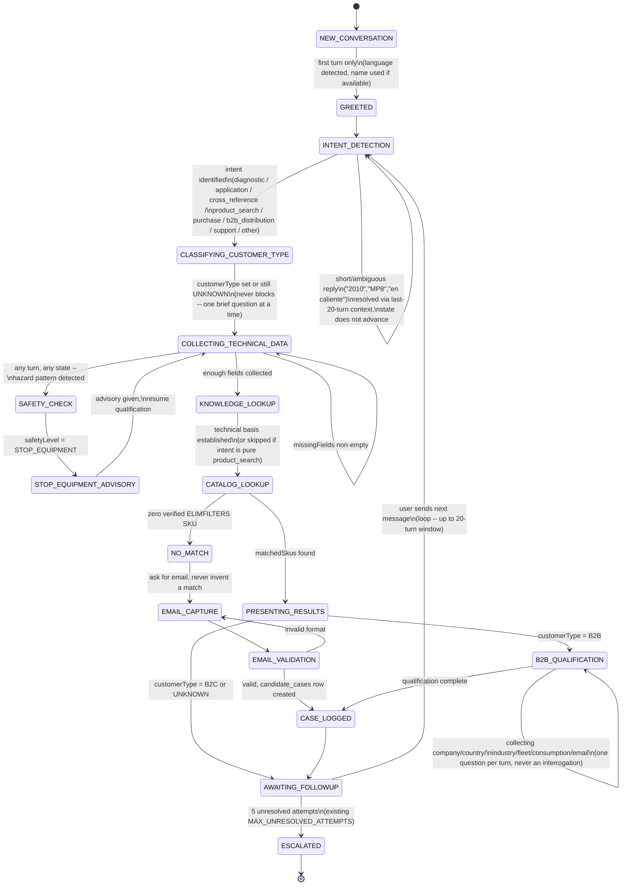

# ELIMFILTERS Conversation Engine — Current State, Gap Closure, and Migration Plan

**Status:** design/proposal only. Nothing in this document has been applied. Migration 065 remains unactivated; `services/facebook-bot`'s `DRY_RUN` flag is unchanged.

## 0. Read this first: the engine already exists

The requested principle — "un cerebro ELIMFILTERS y varios canales, no varios bots independientes" — **is already the live architecture for 2 of 3 active channels, plus web chat.** This document is therefore not a from-scratch design. It is a gap-closure and migration plan against `lib/bot-protocol-unified-orchestrator.js` (protocol v3.3.0) and `lib/bot-conversation-orchestrator.js`, which are:

- Mounted into the live `server-original.js` (confirmed the real boot path: `server.js` → `require('./server-original')`) via `require('./lib/install-bot-protocol').installBotProtocol(app)` at `server-original.js:60`, **before** the legacy `/api/chat` handler at line 724 — the legacy handler is currently dead code, shadowed by the protocol's own `/api/chat` route.
- Already the live backend for **Instagram** (`elimfilters-instagram-bot/src/protocol-client.js`) and **Facebook Messenger** (`services/facebook-bot/src/knowledge.js`), both thin HTTP adapters calling `POST {BOT_PROTOCOL_URL}/api/bot/protocol` with header `x-bot-protocol-key`, default URL `https://part-search.elimfilters.com`.
- Governed by CI: `.github/protocol-lock.json` + `scripts/verify-protocol-lock.js` require an audited OPEN→CLOSED cycle before any change to `lib/bot-protocol-*.js`, `lib/bot-conversation-orchestrator.js`, `lib/install-bot-protocol.js`, `server-protocol.js`, or their tests. **Any change proposed here must go through that lock, not around it.**
- Documented as the intended target in `docs/BOT_PROTOCOL_CONSISTENCY_MATRIX.md`, which already names `elimfilters-whatsapp-bot` as "channel adapter only" — i.e. the project's own docs already call out the exact gap this plan closes.

**Only WhatsApp is disconnected.** `elimfilters-whatsapp-bot/src/{db.js,product-search.js,knowledge-engine.js,knowledge-system.js,knowledge.js}` is a full parallel, independent stack that queries Postgres directly — and per its `render.yaml`, connects to `DATABASE_URL` sourced from `elimfilters-instagram-db`, a **separate** Render Postgres instance ("free" plan) from the canonical `catalogo_elimfilters` database that `elimfilters-search-pro` (and therefore the central engine) uses. This needs field verification (I cannot see that database's contents from here), but the render.yaml evidence is unambiguous enough to treat as a real risk: WhatsApp may be answering from stale or incomplete catalog data, invisible to every migration (061–065) applied so far.

So the actual scope of work is:
1. Close the **output-shape gap** between what the engine returns today and the requested contract (`customerType`, `missingFields`, `safetyLevel`, a single `conversationState` enum) — additive, non-breaking.
2. Add **messageId idempotency** — not present in `lib/bot-protocol-memory.js` today, but a matching mechanism already exists unused in `knowledge_center.channel_events` (Knowledge Center Phase 5) and should be bridged in, not reinvented.
3. **Migrate WhatsApp** to the same thin-adapter pattern Instagram and Facebook already use.
4. Add the **new protocol behaviors** that don't exist yet anywhere: progressive B2B/B2C classification as a structured field, and proactive safety-hazard detection (today's escalation is attempt-count- and self-reported-impact-driven, not a hazard classifier).

---

## 1. Current architecture

```mermaid
flowchart TB
    subgraph Live["Central Engine (LIVE)"]
        SO["server-original.js\n(mounted via server.js → npm start)"]
        IBP["lib/install-bot-protocol.js\ninstallBotProtocol(app)"]
        UO["lib/bot-protocol-unified-orchestrator.js\nruntUnifiedBotProtocol()"]
        CO["lib/bot-conversation-orchestrator.js\nrunBotProtocol() -- 1013-line state machine"]
        MEM["lib/bot-protocol-memory.js\nRedis, 20-turn TTL 24h,\nkey = bot-protocol:{channel}:{conversationId}"]
        CAT["lib/bot-protocol-catalog.js\ndirect Postgres: elimfilters_catalog\noem_codes / competitor_codes JSONB"]
        KE["lib/bot-protocol-knowledge-engine.js\n→ services/knowledge-engine-runtime"]
        ESC["lib/bot-protocol-escalation.js\n5 failed attempts → email ticket"]
        GRD["lib/bot-protocol-guardrails.js\nnative_elimfilters_only"]
        FMT["lib/bot-protocol-channel-format.js\nper-channel limits + language"]
        SEC["lib/bot-protocol-security.js\nx-bot-protocol-key + rate limit"]
        SO --> IBP --> UO --> CO
        CO --> MEM
        CO --> CAT
        CO --> KE
        CO --> ESC
        CO --> GRD
        CO --> FMT
        IBP -.auth.-> SEC
    end

    WEBCHAT["Web chat widget\n/api/chat"] -->|shadows legacy handler| IBP
    IG["Instagram bot\nprotocol-client.js (thin HTTP adapter)"] -->|POST /api/bot/protocol\nx-bot-protocol-key| SO
    FB["Facebook Messenger bot\nservices/facebook-bot\n(DRY_RUN=true, thin HTTP adapter)"] -->|POST /api/bot/protocol| SO

    subgraph Disconnected["NOT connected to the engine"]
        WA["elimfilters-whatsapp-bot\nOWN stack: db.js, product-search.js,\nknowledge-engine.js, knowledge-system.js"]
        WADB[("elimfilters-instagram-db\n(separate Render Postgres,\nfree plan -- NOT the canonical catalog DB)")]
        WA --> WADB
    end

    CANONICAL[("catalogo_elimfilters\n(canonical catalog DB\noregon-postgres)")]
    CAT --> CANONICAL

    LI["elimfilters-linkedin-bot\n(suspended, own render.yaml)"] -.inactive.-> SO
    YT["elimfilters-youtube-bot\n(suspended)"] -.inactive.-> SO

    style Disconnected fill:#3a1a1a,stroke:#c44
    style WADB fill:#3a1a1a,stroke:#c44
```



**Existing conversation persistence infrastructure (unused by the engine today):** `migrations/knowledge-center-phase5/001_channel_ingestion.sql` already defines `knowledge_center.channel_conversations`, `channel_events` (with `UNIQUE(channel, provider, external_event_id)` — exactly the idempotency key this plan needs), `channel_attachments`, and `channel_dead_letters` (retry_count, next_retry_at — exactly the retry infra this plan needs). The `channel` CHECK constraint currently allows `('WHATSAPP','INSTAGRAM','WEB_CHAT','EMAIL','IMPORT')` — **missing `FACEBOOK_MESSENGER` and `LINKEDIN`**, needs extending. This schema is owned by `services/knowledge-channel-gateway`, which itself is a *separate*, currently lightly-used ingestion path (its own `/webhooks/meta` and `/webhooks/web-chat`) — not currently wired to `bot-protocol-memory.js` or `bot-protocol-escalation.js` at all. Reusing it (rather than inventing a parallel table) is the core of the idempotency design in §5.

---

## 2. Proposed architecture

```mermaid
flowchart TB
    subgraph Adapters["Thin channel adapters (no reasoning, no DB, no catalog logic)"]
        WEBCHAT2["Web chat widget"]
        IG2["Instagram adapter\n(unchanged)"]
        FB2["Facebook adapter\n(unchanged, still DRY_RUN)"]
        WA2["WhatsApp adapter\n(NEW -- mirrors protocol-client.js)"]
        LI2["LinkedIn adapter\n(NEW -- code present, service NOT deployed, $0 cost)"]
    end

    ENGINE["Conversation Engine\n(lib/bot-protocol-* + bot-conversation-orchestrator.js,\nextended, same physical service)"]

    Adapters -->|POST /api/bot/protocol\nx-bot-protocol-key\nmessageId required| ENGINE

    ENGINE --> IDEMP["Idempotency + persistence\nknowledge_center.channel_events\n(UNIQUE messageId, extended CHECK)\n+ channel_dead_letters (retries)"]
    ENGINE --> MEM2["Redis: 20-turn working memory\n(unchanged)"]
    ENGINE --> CAT2["Catalog: canonical DB only\nelimfilters_catalog + crossref_resolved_cache\n(065 Tier-2 fallback, once activated)"]
    ENGINE --> KE2["Knowledge Center Phase 2/6\ncandidate_cases + reasoning_traces"]
    ENGINE --> SAFETY["NEW: safety-hazard classifier"]
    ENGINE --> CTYPE["NEW: customerType classifier\n(B2B / B2C / UNKNOWN, progressive)"]

    CAT2 --> CANONICAL2[("catalogo_elimfilters\n(single canonical DB)")]

    style Adapters fill:#12321f,stroke:#4a4
    style ENGINE fill:#1a2a4a,stroke:#48c
```



**What does NOT change:** the engine stays the same physical service (mounted in `server-original.js`), Instagram and Facebook adapters are untouched (they already comply), Redis memory backend is unchanged, the catalog is read-only from the engine's perspective, and 065 stays unactivated (§9 makes this explicit).

**What changes:** WhatsApp gets a new thin adapter and loses its direct DB/knowledge stack; LinkedIn gets a compatible-but-undeployed adapter; the engine's output gains the fields in §6; idempotency moves from "none" to "channel_events UNIQUE constraint, checked before any reply is generated."

---

## 3. Files and repositories that change

| Path | Change | Protocol-locked? |
|---|---|---|
| `elimfilters-whatsapp-bot/src/protocol-client.js` | **NEW** — copy of `elimfilters-instagram-bot/src/protocol-client.js`, `channel: 'whatsapp'` | No |
| `elimfilters-whatsapp-bot/src/worker.js` (or `server.js`) | Replace calls to `product-search.js`/`knowledge-engine.js`/`knowledge-system.js` with `queryCentralProtocol()` | No |
| `elimfilters-whatsapp-bot/src/{db.js,product-search.js,knowledge-engine.js,knowledge-system.js,knowledge.js}` | Retired (moved to `elimfilters-whatsapp-bot/src/_legacy/` for one release, not deleted immediately — see §8 rollback) | No |
| `elimfilters-whatsapp-bot/render.yaml` | Remove `DATABASE_URL` (fromDatabase elimfilters-instagram-db) once verified unused; add `BOT_PROTOCOL_URL`, `BOT_PROTOCOL_API_KEY`, `BOT_PROTOCOL_TIMEOUT_MS` (matching Instagram/Facebook) | No |
| `elimfilters-linkedin-bot/` | Kept as-is in repo (code present); **service removed from active deploy** (see §7) — this is what "adaptador compatible pero sin servicio activo ni costo" means concretely | No |
| `lib/bot-conversation-orchestrator.js` | Add `customerType` classification, `missingFields` array, `safetyLevel`, unify `phase`+`state` into `conversationState` | **Yes** |
| `lib/bot-protocol-unified-orchestrator.js` | Add `messageId` to required input, call idempotency check before `runBotProtocol` | **Yes** |
| `lib/bot-protocol-web-adapter.js` | Add new response fields to the `/api/chat` reshape (additive) | **Yes** |
| `lib/bot-protocol-channel-format.js` | Confirm LinkedIn's existing 1300-char limit stays defined even while inactive | **Yes** |
| **NEW** `lib/bot-protocol-idempotency.js` | Wraps `knowledge_center.channel_events` insert-or-detect-duplicate, called first in `runUnifiedBotProtocol` | **Yes** (new file under protected dir) |
| **NEW** `lib/bot-protocol-safety.js` | Hazard-keyword/pattern classifier producing `safetyLevel` | **Yes** |
| **NEW** `lib/bot-protocol-customer-type.js` | Progressive B2B/B2C classifier | **Yes** |
| `migrations/knowledge-center-phase5/002_extend_channel_enum.sql` | **NEW** — add `FACEBOOK_MESSENGER`, `LINKEDIN` to the `channel` CHECK constraints on `channel_conversations` and `channel_events` | No |
| `migrations/knowledge-center-phase7/001_conversation_engine_state.sql` (or similar) | **NEW** — durable, queryable per-turn trace table (§5) | No |
| `.github/protocol-lock.json` | Opened before touching locked files, closed after, per existing pattern (commit `99e6156d` etc.) | governance |
| `tests/bot-protocol-*.test.js` | Extended with new field assertions + WhatsApp adapter contract test | **Yes** |

**Not touched:** `server-original.js` routing (`installBotProtocol` call stays where it is), `services/facebook-bot` (`DRY_RUN` unchanged, no code change needed — it already speaks the protocol), Instagram bot, `services/knowledge-engine-runtime`, `services/knowledge-center-api`, migration 065, the main catalog tables.

---

## 4. Open item requiring field verification before touching WhatsApp

Confirm what `elimfilters-instagram-db` actually contains and whether `DATABASE_URL` is still load-bearing for Instagram/Facebook (their render.yaml still sets it even though their product-search now goes through the HTTP protocol call — likely vestigial, possibly still used for local rate-limiting/session state; needs a one-line check of their `db.js` usage before deleting the env var). This is a checklist item in §8, not resolved here.

---

## 5. Data schema

Reuses Knowledge Center Phase 5 (`channel_conversations`, `channel_events`, `channel_dead_letters` — already migrated, already has the exact idempotency and retry shape needed) and Phase 2 (`candidate_cases` — already what `createCandidateCase`/escalation feeds). Adds one new table for durable conversation-engine state (Redis is 24h-TTL working memory; this is the queryable trace the user asked for under "trazabilidad").

```sql
-- migrations/knowledge-center-phase5/002_extend_channel_enum.sql
BEGIN;
ALTER TABLE knowledge_center.channel_conversations DROP CONSTRAINT channel_conversations_channel_check;
ALTER TABLE knowledge_center.channel_conversations ADD CONSTRAINT channel_conversations_channel_check
  CHECK (channel IN ('WHATSAPP','INSTAGRAM','FACEBOOK_MESSENGER','WEB_CHAT','LINKEDIN','EMAIL','IMPORT'));
ALTER TABLE knowledge_center.channel_events DROP CONSTRAINT channel_events_channel_check;
ALTER TABLE knowledge_center.channel_events ADD CONSTRAINT channel_events_channel_check
  CHECK (channel IN ('WHATSAPP','INSTAGRAM','FACEBOOK_MESSENGER','WEB_CHAT','LINKEDIN','EMAIL','IMPORT'));
COMMIT;

-- migrations/knowledge-center-phase7/001_conversation_engine_state.sql
BEGIN;
CREATE TABLE IF NOT EXISTS knowledge_center.conversation_engine_state (
  id uuid PRIMARY KEY DEFAULT gen_random_uuid(),
  conversation_id uuid NOT NULL REFERENCES knowledge_center.channel_conversations(id),
  turn_number integer NOT NULL,
  message_id text NOT NULL,          -- external messageId, dedup source of truth lives in channel_events
  language text,
  intent text,
  customer_type text NOT NULL DEFAULT 'UNKNOWN' CHECK (customer_type IN ('B2B','B2C','UNKNOWN')),
  conversation_state text NOT NULL,  -- enum, see Section 6
  missing_fields text[] NOT NULL DEFAULT '{}',
  matched_skus text[] NOT NULL DEFAULT '{}',
  safety_level text NOT NULL DEFAULT 'NONE' CHECK (safety_level IN ('NONE','ADVISORY','STOP_EQUIPMENT')),
  support_lead_id uuid REFERENCES knowledge_center.candidate_cases(id),
  created_at timestamptz NOT NULL DEFAULT now(),
  UNIQUE(conversation_id, turn_number)
);
CREATE INDEX IF NOT EXISTS idx_ces_conversation ON knowledge_center.conversation_engine_state(conversation_id, turn_number);
COMMIT;
```

Design notes:
- `channel_events` already provides messageId idempotency via `UNIQUE(channel, provider, external_event_id)` — the engine's idempotency check (§8) is simply "insert into `channel_events`, if unique-violation then this messageId was already processed, return the cached reply instead of re-running the state machine."
- `conversation_engine_state` is append-only (one row per turn) — deliberately not an UPDATE-in-place table, so it's a full audit trail, not just current state. Redis stays the fast working-memory path; this table is the durable trace.
- Nothing here touches `elimfilters_catalog`, `oem_codes`, `competitor_codes`, or `crossref_resolved_cache`.

---

## 6. State machine



`conversationState` is the single enum value persisted per turn (§5). `GREETED` fires only once per `conversation_id` (checked against `channel_conversations.first_seen_at`, not re-derived from message content) — this directly satisfies "saludar una sola vez." `SAFETY_CHECK` is reachable from any state (drawn as a single transition here for clarity, implemented as a cross-cutting check evaluated every turn before the normal state transition, same pattern `bot-protocol-guardrails.js` already uses for `native_elimfilters_only`).

---

## 7. Conversation Engine contract

Additive changes only — existing consumers (Instagram, Facebook adapters, `bot-protocol-web-adapter.js`) keep working unmodified; new fields are added alongside the current ones (`answer`, `intent`, `phase`, `evidence`, `escalation` stay for one deprecation cycle).

**Request** (`POST /api/bot/protocol`, header `x-bot-protocol-key`):
```jsonc
{
  "channel": "whatsapp | instagram | facebook | linkedin | web | api",
  "conversationId": "string, required",
  "messageId": "string, required -- NEW, external/provider message id for idempotency",
  "message": "string, required",
  "context": { "channel": "...", "conversationId": "...", "language": "es|en|pt (optional hint)" }
}
```

**Response** (superset of today's shape):
```jsonc
{
  "reply": "string",                       // was: answer
  "language": "es | en | pt",              // was: delivery.language
  "intent": "diagnostic | application | cross_reference | product_search | purchase | b2b_distribution | support | other",
  "customerType": "B2B | B2C | UNKNOWN",    // NEW
  "conversationState": "one of the enum values in Section 6", // was: phase + state combined
  "missingFields": ["equipment", "engine", "..."],             // NEW, array (was single pendingField)
  "catalogMatches": [ { "sku": "...", "type": "PRIMARY|ALTERNATE", "specs": {...} } ], // was: evidence.products
  "matchedSkus": ["EA10006", "..."],        // NEW, flat convenience list
  "knowledgeSources": ["kb://..."],         // was: intelligence.knowledge_source_count (now the actual source list, not just a count)
  "safetyLevel": "NONE | ADVISORY | STOP_EQUIPMENT", // NEW
  "nextQuestion": "string | null",          // was: pendingField (field name only) -- NEW: actual phrased question
  "supportLead": { "caseId": "...", "status": "..." } | null, // was: escalation

  // deprecated aliases, kept through one release for existing consumers:
  "answer": "same as reply",
  "phase": "legacy phase value",
  "pending_field": "legacy field name",
  "evidence": { "...": "unchanged shape" },
  "escalation": { "...": "unchanged shape" }
}
```

OEM references are returned inside `catalogMatches[].specs.oemReferences` (informational only, never as `sku`); competitor brand codes are never surfaced as recommendable — this is unchanged from today's `bot-protocol-guardrails.js` behavior, just re-exposed under the new field names.

---

## 8. Idempotency, duplicate protection, timeouts, retries, traceability

- **Idempotency:** first action inside `runUnifiedBotProtocol` becomes `INSERT INTO channel_events (channel, provider, external_event_id, ...) ... ON CONFLICT (channel, provider, external_event_id) DO NOTHING RETURNING id`. No row returned → duplicate delivery → look up and return the already-computed reply from `conversation_engine_state` for that `message_id`, skip re-running the state machine entirely (never re-charges NVIDIA/Groq calls, never double-sends).
- **Timeouts:** adapters already set `BOT_PROTOCOL_TIMEOUT_MS` (Instagram/Facebook default 8000ms) with `AbortController` — WhatsApp's new adapter uses the same pattern, same default. Engine-side, `services/knowledge-engine-runtime` calls get their own shorter timeout (already present in `bot-protocol-knowledge-engine.js`) so a slow RAG lookup degrades to "answer without deep knowledge grounding" rather than hanging the whole turn.
- **Retries:** on adapter-side timeout or 5xx, the adapter retries once with backoff (mirrors what Instagram/Facebook already do) before falling back to a static "estamos teniendo dificultades, un momento" reply. Provider-side webhook retries (Meta re-delivering the same webhook) are absorbed by the idempotency check above, not by adapter logic.
- **Failure trace:** anything that can't be processed after retries goes into `channel_dead_letters` (already exists, already has `retry_count`/`next_retry_at`) instead of being silently dropped.
- **Traceability:** `conversation_engine_state` (§5) is one row per turn, append-only, joined to `channel_events.id` — gives a full, queryable reconstruction of any conversation across channels without depending on Redis's 24h TTL.

---

## 9. LinkedIn — compatible adapter, no active service, no cost

- Code stays exactly where it is (`elimfilters-linkedin-bot/`), already speaks the same protocol shape (`ALLOWED_CHANNELS` in `bot-protocol-security.js` already includes `'linkedin'`; `CHANNEL_LIMITS` in `bot-protocol-channel-format.js` already defines a 1300-char limit for it).
- **Remove `elimfilters-linkedin-bot` from the active Render deploy** (delete its service block from the root `render.yaml`, or set it to `suspended` in the Render dashboard) so it costs nothing and receives no traffic, while the adapter code and its `render.yaml` stay in the repo, ready to redeploy when LinkedIn is reactivated. This satisfies "implementado como adaptador compatible pero sin servicio activo ni costo" literally: compatible (yes, same contract), active service (no), cost (none).
- YouTube is not part of the requested channel set (Instagram/WhatsApp/Facebook/web/LinkedIn) — left untouched, also suspended per your note.

---

## 10. Migration plan (phased, protocol-lock-respecting)

1. **Verification** (no code changes): confirm what `elimfilters-instagram-db` actually contains and whether Instagram/Facebook's `DATABASE_URL` env var is still used for anything (§4). Cheap, blocks nothing else, de-risks the WhatsApp cutover.
2. **Open protocol lock**, land the additive contract fields (§7) behind no behavior change — `reply`/`language`/`conversationState`/etc. computed as straightforward aliases of existing `answer`/`delivery.language`/`phase`+`state` first, before any new classifier logic exists. Ship, verify Instagram/Facebook/web chat are unaffected (they ignore fields they don't read). Close protocol lock.
3. **Open protocol lock**, add `lib/bot-protocol-idempotency.js` wired to `channel_events` (§8), add `migrations/knowledge-center-phase5/002_extend_channel_enum.sql` and `.../phase7/001_conversation_engine_state.sql`. Ship. Close lock.
4. **Open protocol lock**, add `lib/bot-protocol-safety.js` (`safetyLevel`) and `lib/bot-protocol-customer-type.js` (`customerType`, progressive), wire into `bot-conversation-orchestrator.js`'s `buildPayload`. Ship, monitor real conversations for false-positive `STOP_EQUIPMENT` advisories before trusting it fully. Close lock.
5. **Build `elimfilters-whatsapp-bot/src/protocol-client.js`** (new, no lock needed — outside protected paths), wire `worker.js` to call it instead of the legacy stack, **keep the legacy stack in place but unused** behind a `USE_CENTRAL_PROTOCOL` flag defaulting to `false` in a staging deploy first.
6. **Flip `USE_CENTRAL_PROTOCOL=true` for WhatsApp in staging**, run the multichannel test plan (§11) against staging.
7. **Flip in production**, monitor `channel_dead_letters` and `conversation_engine_state` for a full day before removing the legacy WhatsApp files (move to `_legacy/`, delete one release later, not in the same change).
8. **Remove `elimfilters-linkedin-bot` from active deploy** (§9) — independent of the rest, can happen any time.
9. **Explicitly not in this plan:** activating migration 065 (Tier-2 normalized search fallback), and changing `services/facebook-bot`'s `DRY_RUN` flag. Both stay exactly as they are until separately authorized.

---

## 11. Multichannel test plan

**Protocol conformance (run once, applies to every channel through the same engine):**
- Single greeting per `conversationId` across 20 turns (assert `GREETED` state fires exactly once).
- Language detected and held for the whole conversation unless the user switches.
- Short replies ("2010", "MP8", "en caliente", a bare part number) correctly resolved using prior-turn context, not treated as a new intent.
- `customerType` starts `UNKNOWN`, updates to `B2B`/`B2C` only from user signal, never guessed from channel alone (a WhatsApp message doesn't imply B2C).
- Safety hazard phrase (e.g. contaminated hydraulic fluid + "sigue operando") triggers `STOP_EQUIPMENT` before any product recommendation.
- Zero verified SKU → email capture → validation → `candidate_cases` row created, reply never fabricates a SKU.
- B2B path asks company/country/industry/fleet/consumption/email progressively, never all at once.
- Competitor brand codes never appear as a recommendation, only OEM as reference.

**Per-channel adapter tests:**
- Instagram, Facebook: regression only (contract is additive) — confirm existing tests in `tests/bot-protocol-*.test.js` still pass unmodified.
- WhatsApp (new): mirror `tests/bot-protocol-unified-orchestrator.test.js` cases against the new adapter in staging with `USE_CENTRAL_PROTOCOL=true`; confirm catalog answers match what Instagram/web return for the same query (proves it's now reading the canonical DB, not `elimfilters-instagram-db`).
- Web chat: confirm `/api/chat` still returns the deprecated-alias fields unchanged for any existing frontend code, plus the new fields.
- LinkedIn: confirm adapter code still passes its unit tests with no live service — a build/test check, not a deployed smoke test.

**Idempotency/retry tests:**
- Same `messageId` delivered twice (simulating a provider webhook retry) → second call returns the cached reply, no duplicate `channel_events` row, no duplicate outbound send.
- Simulated `knowledge-engine-runtime` timeout → reply still returns (degraded, without deep knowledge grounding) within the adapter's timeout budget.
- Simulated Postgres failure during catalog lookup → event lands in `channel_dead_letters` with a retry schedule, not silently dropped.

---

## 12. Deployment order

1. Verification checklist (§10.1) — no deploy.
2. Contract fields, additive (§10.2) — deploy to `elimfilters-search-pro` only (the engine's host). No adapter changes needed yet.
3. Idempotency + schema migrations (§10.3) — deploy migrations first, then the engine change that uses them.
4. Safety + customerType classifiers (§10.4) — deploy to the engine, monitor before trusting.
5. WhatsApp adapter, flag-gated, staging first (§10.5–10.6).
6. WhatsApp adapter, production, flag flip, monitored (§10.7).
7. LinkedIn service removal from active deploy (§10.8) — independent, any time.
8. **Not deployed by this plan:** migration 065, Facebook `DRY_RUN` change.

---

## 13. Open questions for the team (not blocking this document, blocking step 1)

- What does `elimfilters-instagram-db` actually contain — a full mirrored catalog, a stale snapshot, or just bot-local session data with `elimfilters_catalog` never actually populated there? This determines whether WhatsApp's current wrong answers (if any) are a data-freshness bug worth investigating separately from this migration.
- Is `DATABASE_URL` on the Instagram/Facebook bots still used for anything post-migration, or safe to remove entirely?
- Does `services/knowledge-channel-gateway`'s `/webhooks/meta` and `/webhooks/web-chat` ingestion path need to be reconciled with the engine's new direct `channel_events` writes, or are they intentionally a separate, slower-path ingestion pipeline (e.g. for offline analytics) that can keep running independently? This document assumes the latter and does not modify the gateway service.
